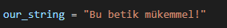
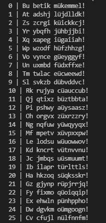

# CAESAR CIPHER (SEZAR ŞİFRELEMESİ)
 
   **Düz metindeki her harfin, alfabeden belirli bir sayı ileride konumlu olan bir harfle değiştirildiği bir şifreleme türüdür.**
   
#SEZAR ŞİFRESİ HAKKINDA: 

1) Kaba kuvvet (brute-force) saldırısıyla çok kolay çözülür. ÇünküŞifreleme/Şifre çözme yöntemi gizli değildir.
2) Sadece 25 (Latin alfabesi harf sayısı) farklı deneme yeterlidir. (Anahtar uzayı 25 elemanlıdır.)
3) Düz metin (plaintext) ve formatı gizli değildir.
4) Harf değiştirme şifrelemelerinde toplam 26! farklı şifre tablosu vardır.

#SCRİPTİN ÇALIŞMA MANTIĞI

   -> Script, girdiğimiz string ifadedeki her karakteri alfabeden bir sayı ileride konumlu olan bir harfle yer değiştirip yeni oluşan stringi ekrana bastırıyor.

#UYGULAMA

   -> Sezar şifresi ile şifrelenmesini istediğiniz ifadeyi our_string adlı değişkenimize atıyoruz.

   -> Artık tek yapmamız gereken scriptimizi çalıştırmak

